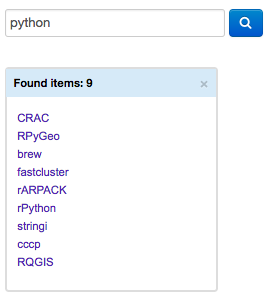

# BitQuery VA-App - TooltipSearch

A search component for BitQuery VA-App: *zoom and filter*. 
Performs search by various parameters, e.g. package, author name etc. 
The results are presented in two ways: the list of found items is displayed in the search tooltip, 
whereas the corresponding nodes in the main visualization are highlighted in red.

## License

Apache License 2.0
